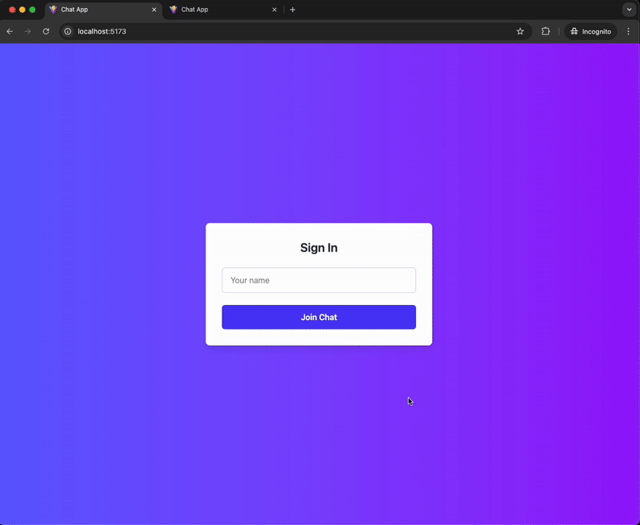

# Chat App

A real-time chat application built with **React** (frontend) and **Go** (backend), featuring live messaging, user identification, and a modern UI powered by Tailwind CSS.

---

## Demo



---

## 🛠️ Features

- Real-time messaging with WebSockets
- User identification and display
- Responsive, modern UI (Tailwind CSS)
- Type-safe React + TypeScript frontend
- Simple Go backend for message broadcasting

---

## 🖥️ Tech Stack

| Layer    | Technology                                                                                                                                        |
| -------- | ------------------------------------------------------------------------------------------------------------------------------------------------- |
| Frontend | [React](https://react.dev/), [TypeScript](https://www.typescriptlang.org/), [Vite](https://vitejs.dev/), [Tailwind CSS](https://tailwindcss.com/) |
| Backend  | [Go](https://golang.org/)                                                                                                                         |
| Protocol | WebSockets                                                                                                                                        |

---

## 📦 Getting Started

### Prerequisites

- [Node.js](https://nodejs.org/) (v18+ recommended)
- [Go](https://golang.org/) (v1.20+ recommended)

### 1. Clone the repository

```sh
git clone https://github.com/your-username/chat-app.git
cd chat-app
```

### 2. Start the Backend (Go)

```sh
cd server
go run main.go
```

### 3. Start the Frontend (React + Vite)

```sh
cd client
npm install
npm run dev
```

Open [http://localhost:5173](http://localhost:5173) in your browser.

---
